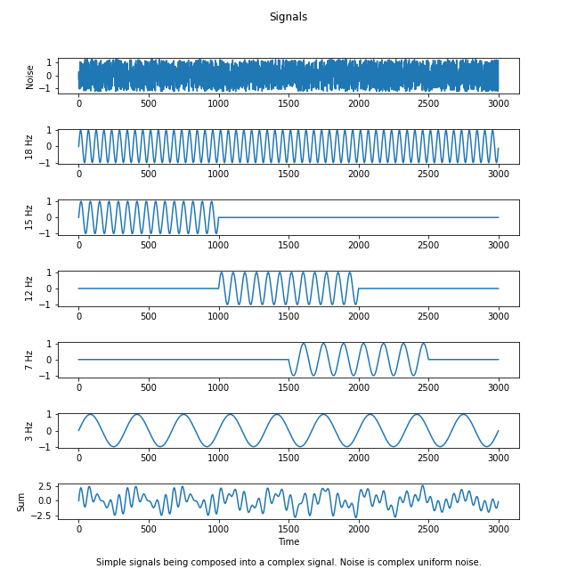
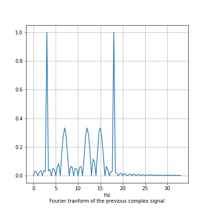
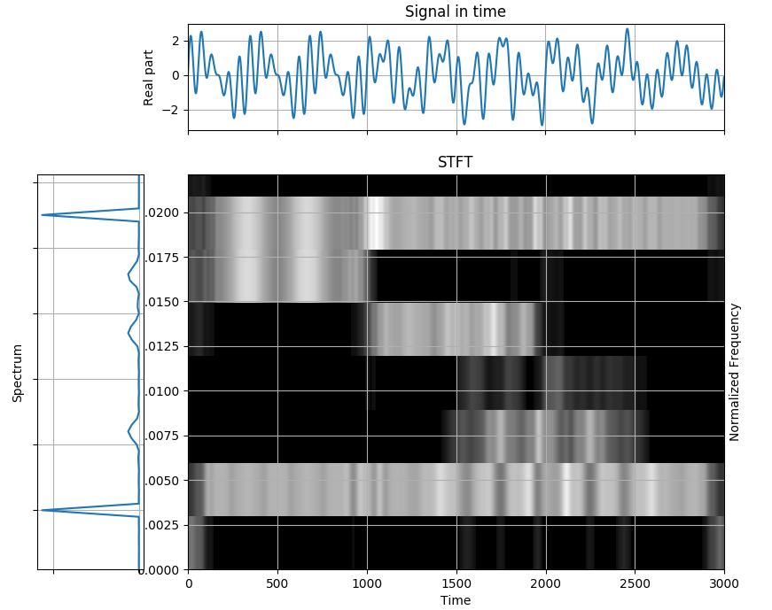
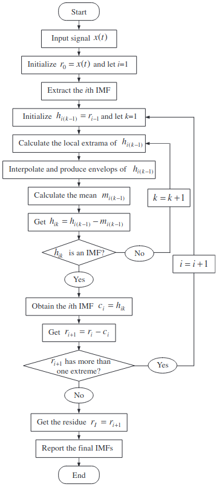
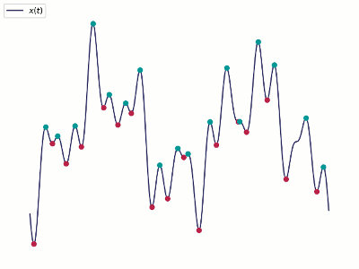
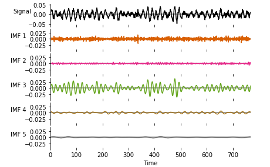
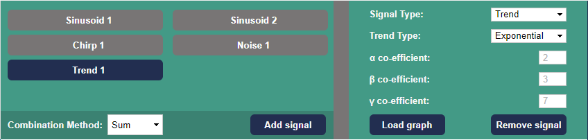
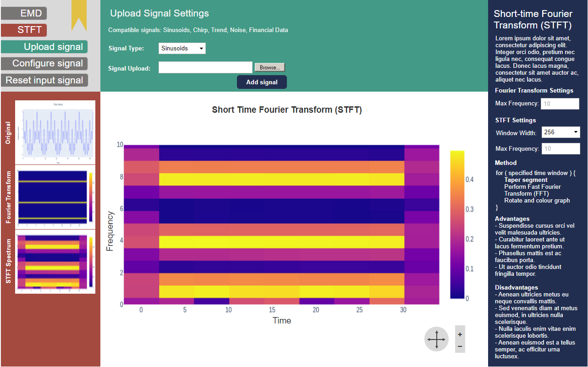
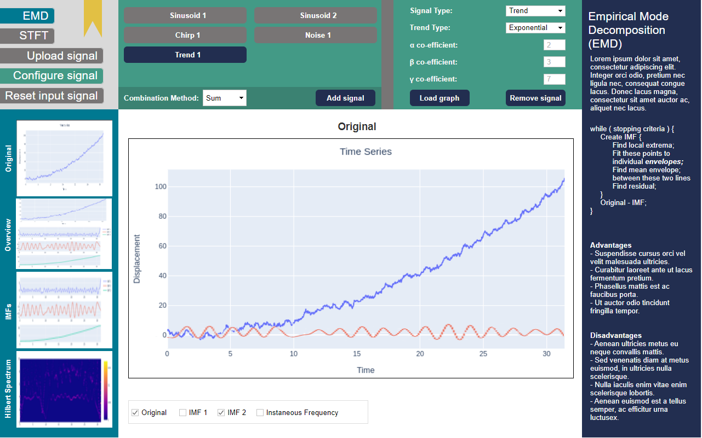
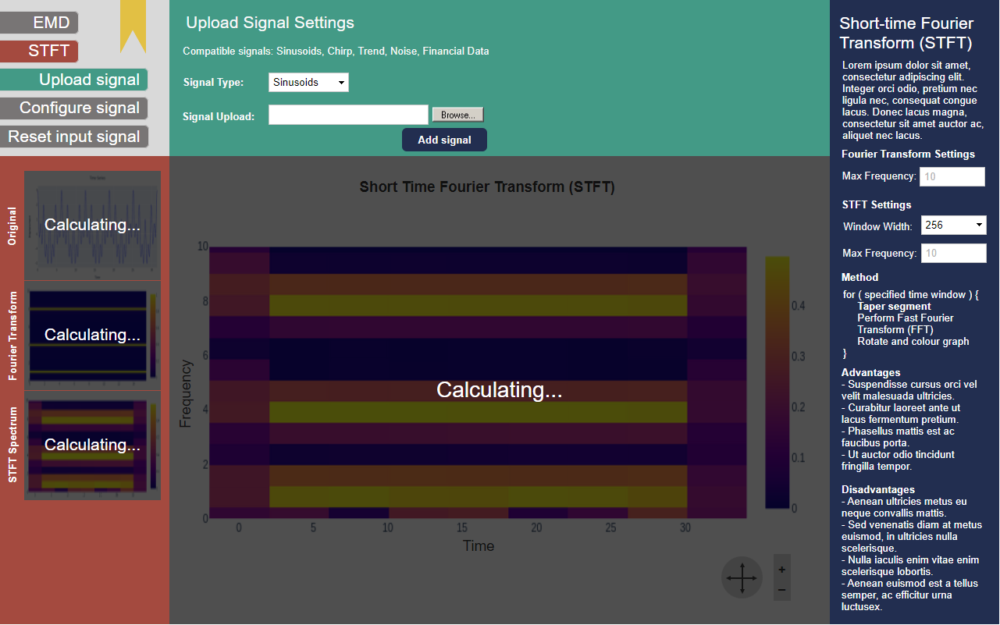

# Background and Motivation
## Motivation
In this project we are seeking to create an educational tool that can be used to interactively explore the differences between two approaches to time series analysis of non-stationary signals. 
The front end only application will allow users to either submit their own signals, or to build one using a library of predefined signal types, and then perform either a Short Time Fourier Transform or a Empirical Mode Decomposition on the signal to break it down into it's constituent component signals.

This will allow them to explore the differences between these two methods for decomposing time signals, serving as a demonstration of their relative strengths and weakness, and providing an intuitive feel for how they work.
The application will also have a number of convenience features for users, such as the ability to bookmark examples, and a pre-generated set of examples that can be used to demonstrate how the application and how the time series analysis techniques work. 

## Background
### Time Series Analysis
A *time series* is a sequence of data points that are indexed or graphed in time order.
Frequently graphed in a run chart (a graph which features time as its $`y`$ axis), time series occur naturally in a wide array of subjects, such as statistics, finance, weather forecasting, and signal processing.

There are a handful of common types of time series that occur widely, for example:
1. Simple sinusoids
1. Linear, exponential, logarithmic, or polynomial trends
1. White, coloured, or shot noise
1. Chirps
1. Products and sums of the above signals, forming complex signals that might be found in the real world 

*Time series analysis* is a set of techniques that can be used in order to reason about time series', enabling an analyst to extract useful insights from the data.

Many time series exhibit an oscillatory behaviour, such as the temperature of a city on any given day of the year, the share price of a given stock, or the audio data recorded by a microphone.
An analyst can exploit the fact that complex signals can be approximated with sums of simpler trigonometric functions and use Fourier analysis to decompose a signal into its oscillatory components.

### Discrete Fourier Transform



A Fourier transform is one way of decomposing a complex signal into its oscillatory components, revealing the frequencies of the constituent component signals.
Determining what component frequencies are present in a signal can give an insight into the nature of a signal, or allow it to be manipulated precisely.
For example, it may allow an audio engineer to silence or boost particular frequencies as they see fit, or a financial analyst to determine what kind of long term trends exist in financial data.
Lets look at an example of a Fourier transform of the previous signal.
We will use the Fast Fourier Transform (FFT) algorithm to compute the transform.



Notice that despite having a strong indication that the constant 3Hz and 18Hz signals are constituent components, much information has been lost.
As a Fourier transform maps a function from the time domain to the frequency domain, all temporal information is lost, as the FFT assumes periodicity.
This is obviously not ideal, as our complex signal is non-linear.
The Fourier transform is thus not well suited to non-linear signals when applied on the entire signal at once.

### Short Time Fourier Transform

Instead, in order to study non-stationary signals, we require a technique that can study a signal in both the time and frequency domain simultaneously.
The simplest of these techniques is the Short Time Fourier Transform (STFT).

The procedure for STFT is to divide a long time signal equally into shorter length segments, and then compute a DFT on each of these segments.
In order to smooth out any unusual artefacts at the boundary of segments, window functions such as a Hann window may be used, which attenuates signals located near boundaries using a cosine window.
With the Fourier spectra of each shorter segment, we can plot the changing spectra against time using a type of plot known as a spectrogram.
Here is an example of STFT applied to our original signal.



Here we can see the strength of each constituent signal by colour intensity.
Unlike previously with the FFT, we now have temporal information, and can see when signals of a given frequency begin and end in the complex signal.

However there is a significant limitation to building on top of Fourier transforms due to an uncertainty limit called the Gabor limit.
By making the time resolution smaller (i.e., by dividing the main signal into smaller windows) we become more certain of when frequencies change, but we loose frequency resolution (the ability to see frequency components close together).
By making the time resolutions larger, we loose time resolution (the ability to know precisely when a frequency changes), but we get better frequency resolution.

### Hilbert-Huang Transform and Empirical Mode Decomposition

The Hilbert-Huang Transform (HHT) is a powerful time-frequency analysis technique.
It allows an analyst to decompose a complex signal into a number of orthogonal Intrinsic Mode Frequencies (IMFs) with a trend using EMD and applies Hilbert Spectral Analysis (HSA) to the IMFs to obtain information regarding instantaneous frequency.

HHT first utilises empirical mode decomposition (EMD) in order to break a complex waveform into IMFs representing simple oscillatory modes through a process called sifting.
The amplitude and frequency of an IMF may vary with time, and must satisfy both of these rules:
1. The total number of extrema and the number of zero crossings must differ by at most 1
2. The mean envelope value (defined by a spline described by the local maxima and the local minima) must be nearly zero

The sifting procedure to extract these IMFs can be described by the following steps:
1. Initialise $`r_0 = X(t)`$ and $`i = 1`$
1. Start outer loop
1. Extract the $`i`$th IMF $`c_i`$
	1. Initialise $`h_{k(k-1)} = r_{i-1}`$, $`k = 1`$
	1. Start inner loop
	1. Identify all of the local maxima and minima (the extrema)
	1. Interpolate the minima with a cubic spline in order to define the lower envelope
	1. Interpolate the maxima with a cubic spline in order to define the upper envelope
	1. Calculate the mean $`m_{i(k-1)}`$ of the upper and lower envelopes of $`h_{i(k-1)}`$. The envelope defined by the two cubic splines should contain all data.
	1. Set $`h_{ik} = h_{i(k-1)} - m_{i(k-1)}`$
	1. Is $`h_{ik}`$ an IMF?
		- If true, set $`c_i = h_{ik}`$ and break
		- Else increment $`k`$ and continue inner loop
1. Set the remainder $`r_{i+1} = r_i - c_i`$
1. Does $`r_{i + 1}`$ contain at least two extrema?
	- If true increment $`i`$ and continue outer loop
	- Else end routine, with $`r_{i + 1}`$ as the signal residue and $`c_1`$ through $`c_i`$ as the IMFs

Below is a flowchart describing this algorithm[^fn1]




And below is an animation of the production of an IMF[^fn2]




The number of sifting steps required to produce an IMF is determined by the stopping criterion.
There are a number of stopping criterion that can be used for EMD, each with their own advantages and disadvantages.
The one proposed by Huang et al. (1998) however is the 'Standard Deviation' method.
For each point in time, the difference between the current component and the previous component is calculated, squared, divided by the square of the previous component evaluated at that point in time, and summed.

```math
SD_{k}=\sum _{{t=0}}^{{T}}{\frac  {|h_{{k-1}}(t)-h_{k}(t)|^{2}}{h_{{k-1}}^{2}(t)}}
```

Once this value falls below a predetermined threshold, the sifting process can be stopped.

There are other stopping criterion that may be used however, such as S Number Criterion or Energy Difference Tracking.

Below we can see an example of EMD being performed on a complex signal, breaking it down into its constituent modes in descending frequency order[^fn3].




At this point, if desired, the instantaneous frequency spectrum can be obtained by applying the Hilbert transform on the constituent IMFs.
The final result would be called a Hilbert spectrum, where the amplitude and instantaneous frequency can be plotted as functions of time on a three dimensional plot.

Unlike STFT, EMD is a self-adaptive signal processing method.
The IMFs are determined by the signal itself, and are representative of the natural oscillatory mode embedded in the signal.
Thus EMD works on the characteristic time local time scale, rather than with predetermined windows.

Of course, EMD has weaknesses as well, for example:

1. EMD suffers from end effects
1. The IMFs may not be orthogonal
1. Mode mixing sometimes occurs between IMFs, where a single IMF includes oscillatory modes that are drastically different or a component of a different IMF all together.

In conclusion, each time-frequency analysis technique has draw backs and advantages, and neither one is conclusively the correct one to use in any given situation.

[^fn1]: Lei, Yaguo, et al. "A review on empirical mode decomposition in fault diagnosis of rotating machinery." *Mechanical systems and signal processing 35.1-2* (2013): 108-126. 
[^fn2]: Photograph by Geir Kulia and modified by Matt Hall, distributed under a Creative Commons Attribution-ShareAlike 4.0 license.
[^fn3]: Example adapted from the Jupyter Notebook tutorials created by the developers of Python's `emd` library, available [here](https://emd.readthedocs.io/en/stable/_downloads/e47aacca40568b7bb056bd96535966c4/emd_tutorials_jupyter.zip)
# Requirements Analysis
This section of the deliverable documents and details both the functional and constraint requirements of the application system which are expected to be delivered in the final submission. For clarity, a 'functional' requirement refers to a component of the system which has been explicitly specified as a necessary piece of functionality for the system to be considered complete, whilst a 'constraint' requirement can be considered more like a non-behavioural requirement, for example the security or portability of a given system. 

Both the functional and constraint requirements have been ordered according to the [MoSCoW prioritization model](https://www.agilebusiness.org/page/ProjectFramework_10_MoSCoWPrioritisation). This model ranks the requirements according to their level of importance; a requirement may be prioritized as either **M**ust have, **S**hould have, **C**ould have or **W**ill not have. Certain abstract and/or actionable requirements will be referenced later in this document with a detailed plan defining how they will be achieved in the final system.

## Functional Requirements
### Signal Analysis

| Requirement Number | Description                                                                                                                                                                                                                                                          | MoSCoW Prioritization |
|--------------------|----------------------------------------------------------------------------------------------------------------------------------------------------------------------------------------------------------------------------------------------------------------------|-----------------------|
| FR-1-1             | The application must support Short-Time Fourier Transform (STFT) time series analysis on input signal data.                                                                                                                                                          | Must Have             
| FR-1-2             | The application must support Empirical Mode Decomposition (EMD) time series analysis on input signal data and export the resultant IMFs for use in other components of the application.                                                                                                                                                           | Must Have                       
| FR-1-3             | The application must support the deconstruction of given, identifiable signal data into its respective functional components. I.e. Deconstruct periodical sinusoidal signal data via STFT and display its extracted frequencies in a spectragram.  | Must Have                    

### User Interface
| Requirement Number | Description                                                                                                                                                                                                          | MoSCoW Prioritization |
|--------------------|----------------------------------------------------------------------------------------------------------------------------------------------------------------------------------------------------------------------|-----------------------|
| FR-2-1             | The application must plot the output of a signal analysis request (STFT, EMD) on given input data visually in a graph embedded in the webpage.                                                                       | Must Have             |
| FR 2-2             | The application must support simultaneously displaying the original, unaltered signal data and the extracted components on a common time base (i.e. over a period of 10 seconds) in a graph embedded in the webpage. | Must Have             |
| FR 2-3             | The application must support simultaneously displaying the instantaneous frequencies of the original components alongside the IMF and STFT estimates in a graph embedded in the webpage.                             | Must Have             |
| FR 2-4             | The application must support 'bookmarking' functionality; allowing users to share their configurations and parameters for signal analysis.                                                                           | Must Have             |
| FR 2-5             | The application must explain the advantages and disadvantages between STFT and EMD signal analysis.                                                                                                                | Must Have           |
| FR 2-6             | The application should display animations showcasing the differences in techniques and behaviours between EMD and STFT analysis.                                                                                     | Should Have           |   
| FR 2-7             | The application should allow the user to generate custom signal data from a set of pre-defined types for processing.                                                                                                                | Should Have           |   

### Generic
| Requirement Number | Description                                                                                                                                                                                                                                   | MoSCoW Prioritization |
|--------------------|-----------------------------------------------------------------------------------------------------------------------------------------------------------------------------------------------------------------------------------------------|-----------------------|
| FR 3-1             | The application must be extensively tested via unit and integration testing to verify individual components behave predictably and correctly, and multiple components working in conjunction behave reliably and deliver the expected result. | Must Have             |
| FR 3-2             | The application must support raw signal data to be uploaded for processing by an end user, and not just rely on pre-generated examples.                                                                                                       | Must Have             |

## Constraint Requirements

### Interface
| Requirement Number | Description                                                                                                                                                                                                                                   | MoSCoW Prioritization |
|--------------------|-----------------------------------------------------------------------------------------------------------------------------------------------------------------------------------------------------------------------------------------------|-----------------------|
| NFR 1-1             | The web application will be easy to use for users. | Should Have             |
| NFR 1-2             | The application must have predefined signal types, which the user can choose from through a drop-down list. | Must Have             |  
| NFR 1-3             | The web application will have an online tutorial embedded for the users to see and learn about the advantages and disadvantages of EMD and STFT. | Must Have             |
| NFR 1-4             |  Allow users to save data visualisations. | Must Have             |

### Performance
| Requirement Number | Description                                                                                                                                                                                                                                   | MoSCoW Prioritization |
|--------------------|-----------------------------------------------------------------------------------------------------------------------------------------------------------------------------------------------------------------------------------------------|-----------------------|
| NFR 2-1             | The web application will have no back-end, all of the functionality will be implemented on the front-end. | Must Have             |
| NFR 2-2             | The application will have low latency, the application will be effiecient in regards to the overhead of the data visualisation. | Could Have             |  
| NFR 2-3             | The application will allow different kinds of data input by the user. It will support data in formats such as CSV.| Could Have             |  
| NFR 2-4             | The application will be efficent with the usage of the memory, to allow smooth animations of the data visualisations and avoid memory problems. | Should Have             |  

### Flexibility
| Requirement Number | Description                                                                                                                                                                                                                                   | MoSCoW Prioritization |
|--------------------|-----------------------------------------------------------------------------------------------------------------------------------------------------------------------------------------------------------------------------------------------|-----------------------|
| NFR 3-1             | The web application will be compatibility across multiple platforms (FireFox, Chrome) | Could Have             |
| NFR 3-2             | The web application will be able to handle stress, it will be stress tested to prevent any glitching or any unexpected events to  occur | Could Have             |
| NFR 3-3             | The application will not be tested or designed for use on Mobile devices. | Will Not Have             |                      
# Task Specifications
## T1: Source and adopt existing STFT analysis algorithm
#### Member Responsible: Callum Stewart
#### Time Required (Estimate): 3 hours
#### Depends on: T3, T6
#### Description: 
A core tenet of our application is the ability to perform Short Time Fourier Transform analysis on a variety of given signal data types. We must, by taking all reasonable steps, avoid implementing this complex algorithm from scratch if possible, and instead adopt a compatible library so that we can direct our efforts on providing functionality elsewhere in the application. With the assumption that our Python-to-JavaScript conversion efforts bear fruit, the [following library](https://docs.scipy.org/doc/scipy/reference/generated/scipy.signal.stft.html) may be of use. 

Once a library has been deemed suitable and compatible with the application architecture, it must be tested before adoption to verify there are no logical inconsistencies between itself and the demo provided to us via Cole's Jupyter notebook, which will act as our benchmark and reference for comparisons. To speed up this process, the proposed test plan is to compare the results of the STFT analysis algorithm in Cole's Jupyter notebook with those returned by the library under test. This test should then identify any logical discrepancies between the two implementations of the algorithm: if the output does not match exactly, the results must be investigated to identify the severity of the difference; if it is merely a matter of accuracy (i.e. length of float result) then this will be noted, however if this not the case then a deeper analysis between the two implementations will be required. 

Once a library has been adopted, unit tests will then be written to ensure consistent results consistent, reliable results are achieved throughout development. These unit tests may then form the basis for integration tests towards the end of development to ensure the analysis and graphing of the results works as expected. 

## T2: Identify & Adopt EMD Algorithm for Signal Analysis
#### Member Responsible: Callum Stewart
#### Time Required (Estimate): 3 hours
#### Depends on: T3, T6
#### Description: 
Another tenet of this application will be its ability to perform Empirical Mode Decomposition analysis on a given sample of signal data. As a consequence of it being a more niche, less well-known algorithm, priority will be assigned to this task to ensure ample time to locate a suitable pre-existing library (for instance, [this one](https://emd.readthedocs.io/en/stable/)) and/or consult the project stakeholders for sample code and resources to re-implement the algorithm independently. The latter being the less desirable of the two options due to the extra time required to ensure the robustness of the implementation; with a 'stable' release of a 3rd party library, a reasonable level of confidence can be assumed that the implementation is robust and free from debilitating bugs. 

Once again, Cole's Jupyter notebook will be utilized as a benchmark and reference point for comparison testing. The sample data provided in the notebook will be utilized within the chosen library, and the results of the EMD analysis will be compared for their similarity. Ideally they will be identical, however if they are not then investigations will be necessary to ascertain why that is the case; if it is due to the accuracy (i.e. length of float values) then this will be deemed a suitable trade-off, however if the results vary greatly then additional time and consultation with the project stakeholders will be required to understand what's going wrong. 

## T3: Identify library and build interface to integrate existing Python code in browser
#### Member Responsible: Bruce Wilson
#### Time Required (Estimate): 15 hours
#### Depends on: T4
#### Description:
To reduce the overall workload of the project, it has been decided that an attempt will be made to ensure interoperability between native Python code and JavaScript. This is because of the development team's familiarity with the language (and hence a reduction in time taken to complete milestones) and the abundance of 1st and 3rd party libraries available for the language, which may ease development considerably (such as Matplotlib, Scipy, Numpy, pandas etc...) 
Preliminary investigations suggest the [Pyodide](https://pyodide.org/en/stable/) javascript library may be suitable for this purpose. This library makes use of the modern browser feature "WebAssembly", allowing native code from various languages (including a compiled full-featured CPython interpreter, with options in include further python packages) to be embedded entirely in browser. It should however be noted that this is not a done deal, and lots of massaging of Python packages and their requirements will be required to ensure that they work through the browser version. Any Python package that also makes use of C native code will have to be pre-compiled into WebAssembly, which may present difficulty.

For this task to be considered complete, the following sub-tasks must be successfully achieved, with any limitations thoroughly documented:
1. Crucially, this approach must support being embedded in a real-time webpage. As this project is considered a 'proof-of-concept', performance concerns can be ignored for the most part, except in extreme cases (i.e. waiting 5 seconds for a graphing animation to be generated will be considered acceptable). 
2. Consultation must be taken with other team members responsible for developing the interactivity of the web-application to identify core/crucial libraries needed to deliver this functionality. Once these libraries are identified, each one must with the intended approach to ensure intended functionality.
3. Finally, the deployment of this approach must require no 'back-end' or server side communication, aside from delivery of the web application to the client. It must work using only the client's browser engine locally.

Due to the inherent risk associated with this task and the implications it has for the remainder of the project's development cycle, it will be given priority over other tasks to verify its completion. If it cannot be achieved, or at least not practically, then an approach will instead be devised using solely JavaScript and HTML; the results of this testing initiative will need to be discovered within a week of Deliverable 2 commencing. 

## T4: Project Management & Documentation
#### Member Responsible: Daniel Scott
#### Time Required (Estimate): 6 hours
#### Depends on: Nil
#### Description:
The project manager is responsible for organising the timely completion of tasks, removing blockers impacting development, leading group discussion and stepping in to assist other members of the group with their tasks, amongst a number of other tasks vital to ensuring development continues unhindered. In addition to this, they are the primary attaché for writing the documentation required for the project, such as Deliverable submissions. 

The plan for executing this task is as follows: 
1. Arrange weekly meetings and monitor attendance to ensure all group members are regularly attending. If recurring absences are observed, privately reach out to the group member(s) inquiring the reason for their absence (should they choose to disclose it) and if they need any additional support with their share of the work. 
2. Correspond with Project Stakeholders on behalf of the group if and when questions arise regarding implementation details that were not ironed out earlier in the project. Relay any new information back to the group.
3. Monitor deliverable progress and assign deadlines in accordance with estimates provided by group members. Regularly reach out to group members during Sprints to check on progress and whether they require any extra assistance. 
4. Plan out project sprints to ensure optimal efficiency with the order of tasks assigned (i.e. it makes no sense to assign a task for a usability study in Week 1, when not even a prototype exists.)
5. Keep on-top of documentation and actively engage with developers if aspects of their implementation are initially unclear. 

## T5: File I/O
#### Member Responsible: Daniel Scott
#### Time Required (Estimate): 3 hours
#### Depends on: T3
#### Description:
The project requires functionality which supports the user submitting their own signal data for both STFT and EMD analysis. A robust File I/O class must be created which will support this behaviour. The class will require a brief design to plan out what file types are supported, the format of the supported files (i.e. JSON lines or JSON array?) and how the information read by the class will be stored for reading by other components of the system. The File I/O class is a non-negligible aspect of the implementation, explicitly being defined as a functional requirement, and thus will take a while to identify suitable approaches and libraries to ensure its functionality matches the requirements set forth.

In addition to the initial design and implementation, a thorough unit-testing strategy will need to be devised which will vet the class under a wide range of circumstances (empty file, irregular data format, file containing special characters etc.) to ensure reliability and robustness when deployed. 

## T6: Creation of custom input signals
#### Member Responsible: Bruce Wilson
#### Time Required (Estimate): 15 hours
#### Depends on: T3
#### Description:
As per the task description, pre-defined signal types should be included for the user to experiment  with both EMD and STFT analysis. Pre-defined signal types must include the following with modifiable parameters:
* Sinusoids (Phase, frequency, and amplitude parameters)
* Chirp signal (Initial frequency, chirp rate, and amplitude parameters)
* Exponential, linear, and polynomial trends (Coefficient parameters)
* White and coloured noise (Seed, amplitude roll off factor, and variance parameters)
* Possion or shot noise (Seed parameter)
* Example financial data

The above list of signal types must also be able to be combined, time-point by time-point, by product and/or sum of signals. Note: Multiples of the same signals are not within the requirements scope.

Due to the parameters of each signal type being fully adjustable (within bounds) by a user, these signals must be generated by the system in browser.

Note: Modifiable parameters do not include time, and as such a constant time must be decided so that all signal types can be combined with ease.

Various existing Python packages can be used for the generation of these signals, such as scipy (for generating [Chirp signals](https://docs.scipy.org/doc/scipy/reference/generated/scipy.signal.chirp.html#scipy.signal.chirp)) or numpy (for generating [Sinusoids](https://numpy.org/doc/stable/reference/generated/numpy.sin.html)). These packages would need to be tested, which depends on the implementation of the python in browser.

A plan to create and test this system is shown below:
1. Find existing python implementations for each required signal type (e.g. scipy, numpy).
2. Ensure that each signal generator implementation has the appropriate modifiable parameters.
3. Using the user interface, allow parameters to be input along with signal type, passed from javascript to the python runtime.
4. Using the interface created for python<->javascript interoperability, ensure that signal data generated in python can be transferred back to the javascript graph viewer.

The following pseudocode demonstrates a user interaction with the system and demonstrates the dataflow between the user interface and the python interpreter:

* 1. User clicks "add signal"
    * 1.1. Select signal type from drop down
    * 1.2. Input parameters depending on signal type
    * 1.3. Click "add signal"
        * 1.3.1. Javascript sends parameters along with signal type to python
        * 1.3.2. Python accepts parameters along with signal type
        * 1.3.3. Switch case depending on signal type
        * 1.3.4. Generate signal depending on parameters, and storing in array
        * 1.3.5. Store array in python global variable, accessible from Javascript
    * 1.4. Javascript generates individual signal graph based on data stored in Python
    * 1.5. If more than one signal has been created then
        * 1.5.1. In Python, generate combined signal depending on type (i.e. sum, product)
        * 1.5.2. Store generated combined signal in Python global variable, accessible from Javascript
    * 1.6. Javascript generates combined signal graph based on global data stored in Python



## T7: Display of individual signals and STFT / EMD analysis
#### Member Responsible: Saad Badshah
#### Time Required (Estimate): 20 hours
#### Depends on: T1, T2, T3, T6, T8
#### Description:
As this system is intended to allow those with little prior knowledge on signal analysis to further their understanding, time must be taken to provide a high quality visual experience.

However, this task depends on the implementation of many other tasks, and as such, only intial testing and decision of a JavaScript graphing library will be done immediately.

Once the key dependancy, T6, has been completed, implementation can begin of the actual display system for converting a Python->Javascript array of time-points to a visual graph. The other key dependancy for this task is T8, where the graph generated must fit itself in well with the rest of the user interface, however this is more in a non-functional stylistic manner rather than a functional implementation manner.

A framework for completing this task is outlined below:
1. Investigate and test which javascript graphing library will work well for our use case. Note that we intend to supply it only with a series of points and axis labels(i.e. amplitude over time), and the graph must allow for pan and zoom over these time-points.
2. Once key dependancies have been completed, implementation of reading Python global variables -> graphing library in Javascript can be created.
3. These graphs must then be placed where required in T8.




## T8: Design and implementation of User-Interface
#### Member Responsible: Abigail Rivera
#### Time Required (Estimate): 20 hours
#### Depends on: T3, T6
#### Description:
A clear consistent user interface (UI) is integral to the fulfilment of the specification as the main use of this web application is educating students with no prior knowledge of the subject matter i.e. Time series decomposition and allowing them to experiment with both methods. Within this task the focus should be around the usefulness and effectiveness of the UI and navigation through the application as an educational tool. All controls, settings and access to graphs should be intuitive to use.

Steps for Completion:
1. Test wireframes designed and ensure they are possible to create within the chosen frontend technologies. Ensure frontend implementation will work well with chosen implementations for graphing animations, processing methods and signal manipulation.
2. Build a base frontend interface for both EMD and STFT methods based on wireframe designs, leaving placeholder sections for the generated graphs. 
3. Communicate with task leads on implementing the EMD, STFT methods as well as input signal manipulation for more detailed setting specifications and include this within the wireframe.
4. Implement bookmarking functionality by adding flags onto URL which will allow the user to share their configuration.
5. Ensure all class and id names follow the same convention and are consistent with other parts of the application. 


Figure X. EMD approach applied to user configured combined signal by product


Figure X. EMD approach applied to user configured combined signal by sum


Figure X. Loading overlay triggered with changes in signal or method chosen


Figure X. STFT approach applied to uploaded signal

## T9: Integration Testing
#### Member Responsible: ?
#### Time Required (Estimate): 10 hours
#### Depends on: All
#### Description:
All software modules that pass unit testing will be subjected to integration testing to ensure the application works as a whole. 

Steps for completion:
1. Identify methodology or framework to be used for integration testing, ensure this is compatible with unit testing process. 
2. Iteratively include all modules as they are completed and updated into the integration testing and provide feedback in a timely manner to the team with any failures identified and possible solutions if applicable.

## T10: Creation of a Tutorial
#### Member Responsible: Callum Stewart
#### Time Required (Estimate): 20 hours
#### Depends on: T7, T8
#### Description:
A tutorial supplemented by the use of designed web app is crucial to fulfilling Deliverable 3. This will involve writing a clear and concise technical article geared toward an audience with a CS background and no prior knowledge of EMD or STFT. The main objective of this task is to allow the user to learn about both methods namely their advantages and disadvantages in order to compare the approaches.

Steps for Completion
1. Gather useful external materials (peer-reviewed papers, video links) that may be linked within the tutorial paper when gaining a thorough understanding of each method.
2. Create a brief introduction explaining the methods and steps taken to implement each method, although these should also be available in the application itself.
3. Collate main advantages and disadvantages of these methods in order to create examples to demonstrate and highlight these. 
4. Outline a guide with screenshots and descriptions to using the application including importing signals, combining signals, configuring method settings, applying each method, navigating different graphs produced, overlaying graphs on same time axis and bookmarking. 
5. Create tasks to work through that demonstrate the various advantages and disadvantages of each method using various different signal types.

## T11: Continuous Risk Management
#### Member Responsible: ?
#### Time Required (Estimate): ?
#### Depends on: All
#### Description:
Managing risk within this project will be handled through an iterative proccess of identifying, preventing and mitigating any known risks. This will be done each week to ensure all critical failures are avoided or mitigated early on. Through the D1 deliverable a risk table has been created with existing risks and will be updated by the task leader with feedback from the rest of the group when required. 

## T12: Demo Presentation
#### Member Responsible: Saad?
#### Time Required (Estimate): 4 hours
#### Depends on: All
#### Description:
After developing a project its very important to have a presentation for the users that can watch it and understand the full functionality of the application. After the completion of this web application, all the members of the team will  make a seminar style project demonstration and a presentation. The steps involved in creating the demo are listed as follows:

Steps for Demonstration:
1. Each individual responsible for a piece of functionality they have been working on will capture a short screen recording of the working functionality they have developed.
2. The team should then make a powerpoint presentation which includes slides on introduction to the project, The background information, architecture of the application, Justification for the technologies used in development and the must have functional requirements, and the planning process which went behind the decisions made to implement the key functionality. Class diagrams flow charts etc can be added to explain the architecture in more detail.
3. The tasks that were assigned will be discussed by each individual that was responsible for the task, the screen recording captured in step 1 should be played and the person who developed it should discuss it in further detail going in detail about how the flow of the functionality works.
4. Future improvements section should be included which discusses the future functionality that can be added to the application to make it more efficent and even perform more detailed analysis and any future functionality that we might want to add.
5. In the end a conclusion section should be included which discussed the key take aways from this project.

## T13: Creation of the design manual
#### Member Responsible: -
#### Time Required (Estimate): 5 hours
#### Depends on: All
#### Description:
As part of the D2 deliverable, a design manual needs to be created that includes a top-level design and enough detail to allow reuse and modification for other students with similar backgrounds without prior knowledge or communication about the application. 

Steps for completion:
1. Identify and document all technologies and libraries used with links where appropriate.
2. Include documentation of how each software module was implemented and any critical notes that may affect further modification. 
3. Design a top-level diagram of how each part of the system works together.


# Risk Analysis

In this section we wiill outline any possible risk that could slow down the project in any way and create a plan of action to minimze the effect any unexpected circumstances have on it.  

This section will be split into 4 tables:
- General Riks 
- Technical Risks
- Actions to Reduce Severity
- Completed Actions

The 'General Risks' section outlines potential risks to the project which cannot be categorized as 'technical'. We describe the possible risks, give them a severity and the chance of the risk occuring. A concise mitigation plan is also written up to give our team a clear plan that will help resolve any probelms caused by the risk.

In 'Technical Risks' we focus on the techincal aspect of the project. We outline the same information as in the 'General Risks': a description, severity, chance of occuring and a mitigation plan, as well as a risk ID that is used in the later tables to identify which action correlates to which risk.

The severity and chance of occuring in the 'General Risks' and 'Techincal Risks' tables can be either: Low, Medium or High. With these values we order the tables so the risks that have the possiblty to case the biggest delays to the project are at the top, this will help us later when defining possible actions to reduce risks as most severe risks should be tacklede first.. 

In 'Actions to Reduce Severity' we outline actions that should be done to reduce either the severity or the chance of the risk occuring for a perticular risk. The table outlines which technical risk will be affected, a person resposible of completing this action and a brief description of the task to be completed. The actions were created in the order of the risks in the 'Technical Risks' table since the most severe risks are at the top of the table.

The final table 'Completed Actions' is used to keep a record of what actions have been completed and how they affected the project risks. The table consists of the risk number, the person responsible for completing the task and how it affected the severity and chance of happening. 

---


## General Risks
| Risk Description | Severity | Chance of Occuring | Mitigation Plan |
|---|:---:|:---:|---|
|Group member not attending a group meeting unexpectedly.|Medium|Low|Project Lead will take over the speaking points of the missing group member. Also if any task allocations are made during a meeting the group member willl have no input over their task (As long as they are allocated reasonably)|
|Group member unable to complete their tasks due to being ill.|Medium|Medium|As soon as we are notified that a group member is unable to complete their current task due to being ill we will have to evaluate what work has been done this week and allocate the uncomplete task to group members with the most available time.|
|Group member not communicating with the rest of the team.|Medium|Low|If a group member goes silent their work will have to be redistributed among the rest of the team for the time they are not responing or until the rest of the project as deadlines still have to be met.|
|Data being lost during the project.|High|Low|Depenging on how far into the project we are restarting the project might be an option but if this would happen near the deadling the project would have to be terminated. To keep the chances as low as possible of any data being lost, all project files, code and report are uploaded to GitLab. Additionally some group members will regularly download a backup of the GitLab repository.|
|Gantt chart deadlines not being met.|High|Medium|If deadlines are being missed we will have to re-evaluate the requirements and focus on the main functionality outlined by 'Must Have' in the requirements, while decreasing the priority on the 'Should Have' and 'Could Have'. |
|Group member disagrees with a project decision|Medium|Low|If only one or two members disagree with a decision it will be ultimetly our project leads choice, if the group member still disagrees they can escelate the problem to the project supervisor.|


### TODO -- add more some general risks

## Technical Risks
| Risk Number | Risk Description | Severity | Chance Of Occuring | Mitigation Plan|
|:---:|---|:---:|:---:|-----|
|1|The EMD or STFT python libraries breaking when running in broswer via `Pyodide`. | High | High  | Depending on the cause of code breaking we will either find alternative libraries for EMD or STFT if they are the cause of the problems, or we will need to port Python code to JavaScript if 'Pyodide' is the problem.|
|2|EMD or STFT libraries braking during runtime. Very unique edge cases can cause the code to break but the majority must be fully working. <br/><br/> Possible extra problems caused if we are forced to translate parts of code from Python to JavaScript. |Medium|High|  |
|3|Initial functional requirements not fully planned out. |High|Medium|If during development we find a part of the requirements to not be fully explained in the functionaly requirements we will set up a short meeting to create a plan for the missing requirements and assign tasks accordingly.|
|4|Support for EMD or STFT in JavaScript might not exist and may need to be ported from Python.|High|Medium|Since our plan is to execute Python code in browser this is has a low chance of being a risk but me may need to port over Python code to JavaScript.|
|5|System memory problems during the runtime of Python code in browser. First tests of running code in browser identified this as a possibility.|Medium|Medium| We will need to find the source of the problem and either fix the code ourselves or find better and more performant libraries that accomplish the same task. |
|6|Problems with GitLab collaboration.|Medium|Medium| As GitLab is a requirement in this project, GitLab breaking would be a unique circumstance that would need to be resolved with the project supervisor. |
|7|Not fully understanding the mathematics behind EMD or STFT. | Medium | Medium | Meet up with Cole if possible to get clarification on parts of the mathematics that we do not understand. |
|8|Concurrency issues in JavaScript. In testing we found that using Python in browser via `Pyodide` runs everything on the main thread and web page becomes unresponsive while running code, so concurrency will need to be added for a smoother experience. |Low|Medium|If during development we are unable to make the application concurrent, we will just have to run the application on a single thread which isn't a big problem as having the application run faster is just a nice to have feature. Will just need to add a warning for the user to inform them that the application might appear frozen at times.
|9|User interface of the front end missing features or badly designed. |Medium|Low| We will need to sketch up new interface mock ups and focus on adding features we have missed in the planning stage or were badly designed. |
|10| Requirements analysis document missing sections, have incomplete sections or sections aren't up to the specifications. |Medium|Low|If any requirements are found to be missing during development we will need to organise a meeting to create plans for the missing requirements and allocate the tasks.


## Current Actions to Reduce Severity
| Risk Number | Person Responsible | Possible Action to Reduce Severity |
|:---:|:---:|---|
|1|Bruce|Create a test environment to test running Python code in browser via `Pyodide`, if unsuccessful, test the other options discussed in the first meeting. |
||Callum| Create unit test to check how robust the EMD and STFT libraries are, if any problems are found we will try to fix the code thats the problem or if that is unfeasible  we will notify the user of the limitations if there are any.<br/>Run extra tests in a `Pyodide` environment to further test the robustness of both the code and the Python code running in browser.|
|| Saad | If possible meet up with Cole and present the current requirements and get feedback from him and make any change to the requirements that he may suggest. |
|| Sebastian | Have a seesion with the entire team to make sure every team member fully understands how collaboration in GitLab works. |
||	Abigail | Again a meeting with Cole would be ideal as he will know best what the users would look for in the front end, possibly discuss this in the same meeting as the requirements.|
||Daniel|Discuss the state of the current draft of the document in a meeting, if problems arise then chase up people responsible for certain sections or assign help to incomplete sections.|
|||We will have to make regular back ups in case some problems arise with GitLab, and one person will be resposible for keeping the GitLab repository organised.|

## Completed Actions 
| Risk Number | Person Responsible | Action and effect on risk |
|:---:|:---:|---|
||||

### TODO -- Move completed actions to the table
# Software Integration Plan

Care must be taken during planning to ensure that each of the developed software systems integrate with one another seamlessly. 
To do this, a plan must be made that takes into account each tasks dependencies on others, and organises which order software modules must be combined for incremental systems testing.

The implementation side of the project can be split into two key areas. The first is our Python "backend" (by backend, we mean a full CPython WebAssembly implementation running **in browser**) which performs all our numerical calculations and analysis, such as STFT, EMD, and signal generation/combining. 
The second is our JavaScript/html "frontend", which handles visualisation of the returned data sets from the Python backend, alongside handing data transfer from the user to the backend.

Due to the nature of the Python backend scripting and frontend development, these developments can be parallelised.

However, an agreement must be made in the order of arguments being passed between the frontend interface and the backend. These can be summarised below:

* When "add signal" button is clicked:
    * Signal type + signal parameters must be passed to the backend from user interface input parameters (plus any summing information for a combined signal).
    * Backend must return an array of time-points representing the signal (plus any combined signal).
    * Frontend should handle the array of time-points and display them on an interactive graph.

Note that from the above summary, there is two discrete information passes. When the frontend sends the user input parameters to the backend, and when the backend returns the array of time points.
Due to the implementation of backend<->front end that we are using, the key thing to take into account is data types when converting from Python to Javascript, for example, numpy arrays may convert to difficult to use objects in Javascript. Testing of this must be performed early to ensure later development can flow easily.

A second data passing scenario is summarised below:

* When "analyse signal" is initiated:
    * Type of analysis to perform + any parameters must be passed to the backend from the user interface.
    * The backend already knows which signals have been generated previously (or uploaded signals), alongside their combined signal.
    * Specified analysis type must be performed by the backend, returning the appropriate data depending on the analysis type (e.g. EMD -> IMF's...).

Note that here, the data that is being passed back may be more complex than simple 1D arrays as before with the time-point signal arrays.

Using the two examples listed above, we can see that the Python backend is acting similar to a RESTful API, however with statefulness (as the Python backend is only serving one user on their own browser, we can save large data back and forth by storing the state of the signals generated).

What this means is we can create the Python signal generating code, signal combining, EMD analysis, STFT analysis, as separate Python modules that all can communicated with from Javascript, and all can communicate to store their state with a memory module (or more simply, organised Python globals).

These modules in theory can be developed independently from each other, however they must follow the agreements made previously on which data and in what order it will be sent.

Following the above theory, the following plan is created:

* Development of the frontend interface bar signal graphing/visualisation shall begin immediately.
* Development of signal generation in Python can begin immediately, with the agreement of which input parameters shall be sent through Javascript to the backend. These signals generated must be stored in a Python global scope, in a format that is reusable in Python and Javascript (e.g. 1D array)
* Development of the signal combination can begin once the signal generation code is able to save data to the Python global scope. This combined signal will also be stored in a Python global scope.
* Development of the STFT and EMD algorithms can begin once the signal combination is able to save data to the Python global scope (accessing the combined data signal). 
* Development of the user-uploading data can begin once the signal generation Python module is complete. This ensures that the uploaded data module will have to use the agreed upon combined signal storing method, and EMD/STFT will be able to access the user uploaded data as if it was generated with our system.
* Development of the graphing system can begin once signal generation is able to return data from Python. This may not include all signal types, however once one signal type is correctly being stored and returned, it can be used as an example of how all other signals will be returned from Python to be displayed on the frontend.
* Development of the tutorial can begin once the graphing system alongside frontend interface are near completion.

Due to the nature of the Python modules, unit testing will be able to be performed on each component individually, alongside following the plan above will aid with knowing when each part of the system can join as part of the system integration tests.# Gantt Chart
# Table of Responsiblities
The table below outlines how the reponsiblities in the team are distributed using the RACI model with the acronyms being explained in the key below. 

|Acronym|Role|Description|
|:---:|---|:---:|
|R|Responsible|Team members who work to complete the task.|
|A|Accountable|Task leader i.e. the one answerable for the completion of the task|
|C|Consulted|Team members who should be contacted and dicuss matters relating to the task|
|I|Informed|Team members who should be informed of task progress usually on completion of a task|

*no task leader identified yet

|Task Number|Task Description|Bruce|Callum|Saad|Sebastian|Abigail|Daniel|
|:---:|---|:---:|:---:|---|:---:|---|:---:|
|T1|Source and adopt existing STFT analysis algorithm|C|A|I|I|I|C|
|T2|Identify & Adopt EMD Algorithm for Signal Analysis|C|A|I|I|I|C|
|T3|Identify library and build interface to integrate existing Python code in browser|A|C|I|I|C|C|
|T4|Project Management & Documentation|I|I|C|I|C|A|
|T5|File I/O|I|I|I|I|I|A|
|T6|Creation of custom input signals*|C|C|I|I|C|I|
|T7|Display of individual signals and STFT / EMD analysis|A|C|I|I|C|C|
|T8|Design and implementation of User-Interface|C|C|I|I|A|C|
|T9|Unit Testing*|C|C|C|C|C|C|
|T10|Integration Testing*|C|C|C|C|C|C|
|T11|Creation of a Tutorial|C|C|C|C|A,R|C|
|T12|Continuous Risk Management*|C,R|C,R|C,R|C,R|C,R|C,R|
|T13|Demo Presentation|C,R|C,R|A,R|C,R|C,R|C,R|
|T14|Creation of the design manual*|C|C|I|I|C|C|
# Requirements Traceability Matrix 
| ID      | Requirement Description | Task ID     | Progress  |
| :---        |    :----:   |          ---: |            ---:       |
| FR 1      | The application must support Short-Time Fourier Transform (STFT) time series analysis on input signal data.       | T1   |                       |
| FR 2   | The application must support Empirical Mode Decomposition (EMD) time series analysis on input signal data. |      T2                 |
| FR 3   |    The application must be able to identify the type of signal either generated or uploaded by an end user. E.g. Sinusoidal, Trending, Noise, Chirping etc.        | T2      |                       |
| FR 4   | The application must support the deconstruction of given, identifiable signal data into its respective functional components. I.e. The orthogonal, sinusoidal components of a periodic signal can be extracted via Fast Fourier Transform and delivered to the user.       | T6      |                       |
| FR 5   | The application must support the extraction of Intrinsic Mode Functions (IMF) from given signal data via EMD analysis.        | .     |                       |
| FR 6   | The application must plot the output of a signal analysis request (STFT, EMD) on given input data visually in a graph embedded in the webpage.        | T7      |                       |
| FR 7   | The application must support simultaneously displaying the original, unaltered signal data and the extracted components on a common time base (i.e. over a period of 10 seconds) in a graph embedded in the webpage.        | T7     |                       |
| FR 8   | The application must support simultaneously displaying the instantaneous frequencies of the original components alongside the IMF and STFT estimates in a graph embedded in the webpage.        | T7      |                       |
| FR 9   | The application must support 'bookmarking' functionality; allowing users to share their configurations and parameters for signal analysis.        | T8      |                       |
| FR 10   | The application should display animations showcasing the differences in techniques and behaviours between EMD and STFT analysis.        | T11      |                       |
| FR 11   | The application should explain the advantages and disadvantages between STFT and EMD signal analysis.        | T10      |                       |
| FR 12   | The application should allow the user to generate custom signal data from a set of pre-defined types for processing.        | T8     |                       |
| FR 13   | The application must be extensively tested via unit and integration testing to verify individual components behave predictably and correctly, and multiple components working in conjunction behave reliably and deliver the expected result.        | T9    |                       |
| FR 14   | The application must support raw signal data to be uploaded for processing by an end user, and not just rely on pre-generated examples.        | T3      |                       |
| NFR 15   | The web application will be easy to use for users        | T8     |                       |
| NFR 16  | The application must have predefined signal types, which the user can choose from through a drop-down list        | T6      |                       |
| NFR 17  | The web application will have an online tutorial embedded for the users to see and learn about the advantages and disadvantages of EMD and STFT        | T11     |                       |
| NFR 18   |Allow users to save Data visualisations        | .      |                       |
| NFR 19   | The web application will have no back-end, all of the functionality will be implemented on the front-end       | .     |                       |
| NFR 20   | The application will have very low or no latency since there is no back-end delays        | .     |                       |
| NFR 21   | The application will allow different kinds of data input by the user. It will support data in formats such as CSV        | T5      |                       |
| NFR 22   | The application will be efficent with the usage of the memory, to allow smooth animations of the data visualitsation and avoid memory problems        |T7     |                       |
| NFR 23   | The web application will be compatibility across multiple platforms (FireFox, Chrome)       | T8    |                       |
| NFR 24   | The web application will be able to handle stress, it will be stress tested to prevent any glitching or any unexpected events to  occur        | T9      |                       |
# Appendix
