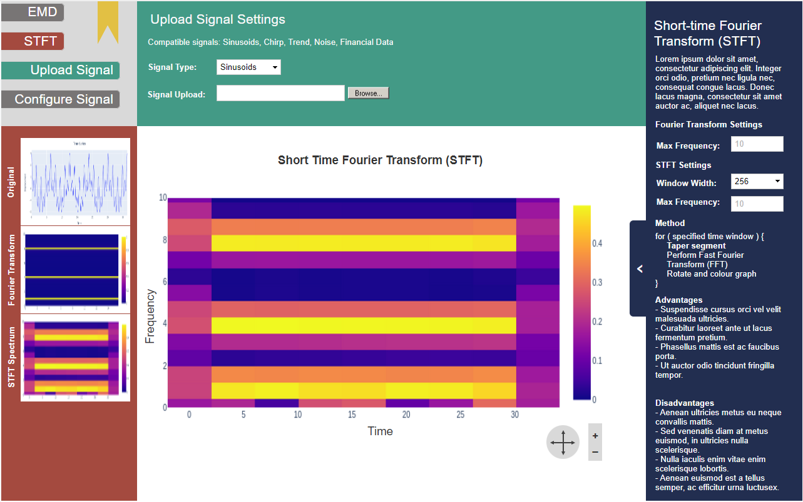
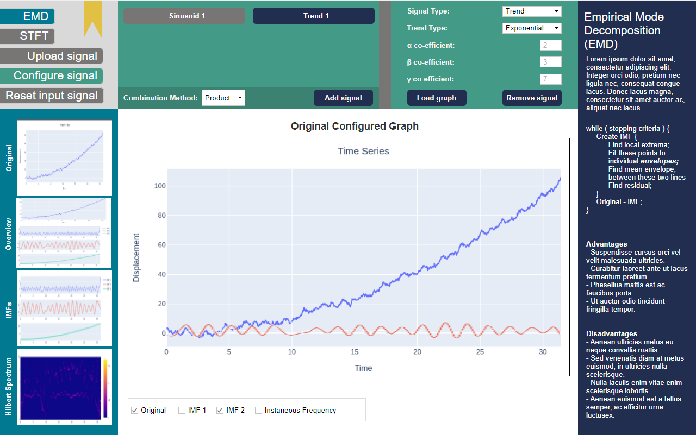

# Task Specifications
## T1: Source and adopt existing STFT analysis algorithm
#### Member Responsible: Callum Stewart
#### Time Required (Estimate): 3 hours
#### Depends on: T3, T6
#### Description: 
A core tenet of our application is the ability to perform Short Time Fourier Transform analysis on a variety of given signal data types. We must, by taking all reasonable steps, avoid implementing this complex algorithm from scratch if possible, and instead adopt a compatible library so that we can direct our efforts on providing functionality elsewhere in the application. With the assumption that our Python-to-JavaScript conversion efforts bear fruit, the [following library](https://docs.scipy.org/doc/scipy/reference/generated/scipy.signal.stft.html) may be of use. 

Once a library has been deemed suitable and compatible with the application architecture, it must be tested before adoption to verify there are no logical inconsistencies between itself and the demo provided to us via Cole's Jupyter notebook, which will act as our benchmark and reference for comparisons. To speed up this process, the proposed test plan is to compare the results of the STFT analysis algorithm in Cole's Jupyter notebook with those returned by the library under test. This test should then identify any logical discrepancies between the two implementations of the algorithm: if the output does not match exactly, the results must be investigated to identify the severity of the difference; if it is merely a matter of accuracy (i.e. length of float result) then this will be noted, however if this not the case then a deeper analysis between the two implementations will be required. 

Once a library has been adopted, unit tests will then be written to ensure consistent results consistent, reliable results are achieved throughout development. These unit tests may then form the basis for integration tests towards the end of development to ensure the analysis and graphing of the results works as expected. 

## T2: Identify & Adopt EMD Algorithm for Signal Analysis
#### Member Responsible: Callum Stewart
#### Time Required (Estimate): 3 hours
#### Depends on: T3, T6
#### Description: 
Another tenet of this application will be its ability to perform Empirical Mode Decomposition analysis on a given sample of signal data. As a consequence of it being a more niche, less well-known algorithm, priority will be assigned to this task to ensure ample time to locate a suitable pre-existing library (for instance, [this one](https://emd.readthedocs.io/en/stable/)) and/or consult the project stakeholders for sample code and resources to re-implement the algorithm independently. The latter being the less desirable of the two options due to the extra time required to ensure the robustness of the implementation; with a 'stable' release of a 3rd party library, a reasonable level of confidence can be assumed that the implementation is robust and free from debilitating bugs. 

Once again, Cole's Jupyter notebook will be utilized as a benchmark and reference point for comparison testing. The sample data provided in the notebook will be utilized within the chosen library, and the results of the EMD analysis will be compared for their similarity. Ideally they will be identical, however if they are not then investigations will be necessary to ascertain why that is the case; if it is due to the accuracy (i.e. length of float values) then this will be deemed a suitable trade-off, however if the results vary greatly then additional time and consultation with the project stakeholders will be required to understand what's going wrong. 

## T3: Identify library and build interface to integrate existing Python code in browser
#### Member Responsible: Bruce Wilson
#### Time Required (Estimate): 15 hours
#### Depends on: T4
#### Description:
To reduce the overall workload of the project, it has been decided that an attempt will be made to ensure interoperability between native Python code and JavaScript. This is because of the development team's familiarity with the language (and hence a reduction in time taken to complete milestones) and the abundance of 1st and 3rd party libraries available for the language, which may ease development considerably (such as Matplotlib, Scipy, Numpy, pandas etc...) 
Preliminary investigations suggest the [Pyodide](https://pyodide.org/en/stable/) javascript library may be suitable for this purpose. This library makes use of the modern browser feature "WebAssembly", allowing native code from various languages (including a compiled full-featured CPython interpreter, with options in include further python packages) to be embedded entirely in browser. It should however be noted that this is not a done deal, and lots of massaging of Python packages and their requirements will be required to ensure that they work through the browser version. Any Python package that also makes use of C native code will have to be pre-compiled into WebAssembly, which may present difficulty.

For this task to be considered complete, the following sub-tasks must be successfully achieved, with any limitations thoroughly documented:
1. Crucially, this approach must support being embedded in a real-time webpage. As this project is considered a 'proof-of-concept', performance concerns can be ignored for the most part, except in extreme cases (i.e. waiting 5 seconds for a graphing animation to be generated will be considered acceptable). 
2. Consultation must be taken with other team members responsible for developing the interactivity of the web-application to identify core/crucial libraries needed to deliver this functionality. Once these libraries are identified, each one must with the intended approach to ensure intended functionality.
3. Finally, the deployment of this approach must require no 'back-end' or server side communication, aside from delivery of the web application to the client. It must work using only the client's browser engine locally.

Due to the inherent risk associated with this task and the implications it has for the remainder of the project's development cycle, it will be given priority over other tasks to verify its completion. If it cannot be achieved, or at least not practically, then an approach will instead be devised using solely JavaScript and HTML; the results of this testing initiative will need to be discovered within a week of Deliverable 2 commencing. 

## T4: Project Management & Documentation
#### Member Responsible: Daniel Scott
#### Time Required (Estimate): 6 hours
#### Depends on: Nil
#### Description:
The project manager is responsible for organising the timely completion of tasks, removing blockers impacting development, leading group discussion and stepping in to assist other members of the group with their tasks, amongst a number of other tasks vital to ensuring development continues unhindered. In addition to this, they are the primary attaché for writing the documentation required for the project, such as Deliverable submissions. 

The plan for executing this task is as follows: 
1. Arrange weekly meetings and monitor attendance to ensure all group members are regularly attending. If recurring absences are observed, privately reach out to the group member(s) inquiring the reason for their absence (should they choose to disclose it) and if they need any additional support with their share of the work. 
2. Correspond with Project Stakeholders on behalf of the group if and when questions arise regarding implementation details that were not ironed out earlier in the project. Relay any new information back to the group.
3. Monitor deliverable progress and assign deadlines in accordance with estimates provided by group members. Regularly reach out to group members during Sprints to check on progress and whether they require any extra assistance. 
4. Plan out project sprints to ensure optimal efficiency with the order of tasks assigned (i.e. it makes no sense to assign a task for a usability study in Week 1, when not even a prototype exists.)
5. Keep on-top of documentation and actively engage with developers if aspects of their implementation are initially unclear. 

## T5: File I/O
#### Member Responsible: Daniel Scott
#### Time Required (Estimate): 3 hours
#### Depends on: T3
#### Description:
The project requires functionality which supports the user submitting their own signal data for both STFT and EMD analysis. A robust File I/O class must be created which will support this behaviour. The class will require a brief design to plan out what file types are supported, the format of the supported files (i.e. JSON lines or JSON array?) and how the information read by the class will be stored for reading by other components of the system. The File I/O class is a non-negligible aspect of the implementation, explicitly being defined as a functional requirement, and thus will take a while to identify suitable approaches and libraries to ensure its functionality matches the requirements set forth.

In addition to the initial design and implementation, a thorough unit-testing strategy will need to be devised which will vet the class under a wide range of circumstances (empty file, irregular data format, file containing special characters etc.) to ensure reliability and robustness when deployed. 

## T6: Creation of custom input signals
#### Member Responsible: Bruce Wilson
#### Time Required (Estimate): 15 hours
#### Depends on: T3
#### Description:
As per the task description, pre-defined signal types should be included for the user to experiment  with both EMD and STFT analysis. Pre-defined signal types must include the following with modifiable parameters:
* Sinusoids (Phase, frequency, and amplitude parameters)
* Chirp signal (Initial frequency, chirp rate, and amplitude parameters)
* Exponential, linear, and polynomial trends (Coefficient parameters)
* White and coloured noise (Seed, amplitude roll off factor, and variance parameters)
* Possion or shot noise (Seed parameter)
* Example financial data

The above list of signal types must also be able to be combined, time-point by time-point, by product and/or sum of signals. Note: Multiples of the same signals are not within the requirements scope.

Due to the parameters of each signal type being fully adjustable (within bounds) by a user, these signals must be generated by the system in browser.

Note: Modifiable parameters do not include time, and as such a constant time must be decided so that all signal types can be combined with ease.

Various existing Python packages can be used for the generation of these signals, such as scipy (for generating [Chirp signals](https://docs.scipy.org/doc/scipy/reference/generated/scipy.signal.chirp.html#scipy.signal.chirp)) or numpy (for generating [Sinusoids](https://numpy.org/doc/stable/reference/generated/numpy.sin.html)). These packages would need to be tested, which depends on the implementation of the python in browser.

A plan to create and test this system is shown below:
1. Find existing python implementations for each required signal type (e.g. scipy, numpy).
2. Ensure that each signal generator implementation has the appropriate modifiable parameters.
3. Using the user interface, allow parameters to be input along with signal type, passed from javascript to the python runtime.
4. Using the interface created for python<->javascript interoperability, ensure that signal data generated in python can be transferred back to the javascript graph viewer.

The following pseudocode demonstrates a user interaction with the system and demonstrates the dataflow between the user interface and the python interpreter:

* 1. User clicks "add signal"
    * 1.1. Select signal type from drop down
    * 1.2. Input parameters depending on signal type
    * 1.3. Click "add signal"
        * 1.3.1. Javascript sends parameters along with signal type to python
        * 1.3.2. Python accepts parameters along with signal type
        * 1.3.3. Switch case depending on signal type
        * 1.3.4. Generate signal depending on parameters, and storing in array
        * 1.3.5. Store array in python global variable, accessible from Javascript
    * 1.4. Javascript generates individual signal graph based on data stored in Python
    * 1.5. If more than one signal has been created then
        * 1.5.1. In Python, generate combined signal depending on type (i.e. sum, product)
        * 1.5.2. Store generated combined signal in Python global variable, accessible from Javascript
    * 1.6. Javascript generates combined signal graph based on global data stored in Python

## T7: Display of individual signals and STFT / EMD analysis
#### Member Responsible: Saad Badshah
#### Time Required (Estimate): 20 hours
#### Depends on: T1, T2, T3, T6, T8
#### Description:
As this system is intended to allow those with little prior knowledge on signal analysis to further their understanding, time must be taken to provide a high quality visual experience.

However, this task depends on the implementation of many other tasks, and as such, only intial testing and decision of a JavaScript graphing library will be done immediately.

Once the key dependancy, T6, has been completed, implementation can begin of the actual display system for converting a Python->Javascript array of time-points to a visual graph. The other key dependancy for this task is T8, where the graph generated must fit itself in well with the rest of the user interface, however this is more in a non-functional stylistic manner rather than a functional implementation manner.

A framework for completing this task is outlined below:
1. Investigate and test which javascript graphing library will work well for our use case. Note that we intend to supply it only with a series of points and axis labels(i.e. amplitude over time), and the graph must allow for pan and zoom over these time-points.
2. Once key dependancies have been completed, implementation of reading Python global variables -> graphing library in Javascript can be created.
3. These graphs must then be placed where required in T8.

## T8: Design and implementation of User-Interface
#### Member Responsible: Abigail Rivera
#### Time Required (Estimate): 20 hours
#### Depends on: T3, T6
#### Description:
A clear consistent user interface (UI) is integral to the fulfilment of the specification as the main use of this web application is educating students with no prior knowledge of the subject matter i.e. Time series decomposition and allowing them to experiment with both methods. Within this task the focus should be around the usefulness and effectiveness of the UI and navigation through the application as an educational tool. All controls, settings and access to graphs should be intuitive to use.

Steps for Completion:
1. Test wireframes designed and ensure they are possible to create within the chosen frontend technologies. Ensure frontend implementation will work well with chosen implementations for graphing animations, processing methods and signal manipulation.
2. Build a base frontend interface for both EMD and STFT methods based on wireframe designs, leaving placeholder sections for the generated graphs. 
3. Communicate with task leads on implementing the EMD, STFT methods as well as input signal manipulation for more detailed setting specifications and include this within the wireframe.
4. Implement bookmarking functionality by adding flags onto URL which will allow the user to share their configuration.
5. Ensure all class and id names follow the same convention and are consistent with other parts of the application. 

Figure X. EMD approach applied to user configured combined signal by product

Figure X. EMD approach applied to user configured combined signal by sum

Figure X. Loading overlay triggered with changes in signal or method chosen

Figure X. STFT approach applied to uploaded signal

## T9: Integration Testing
#### Member Responsible: ?
#### Time Required (Estimate): 10 hours
#### Depends on: All
#### Description:
All software modules that pass unit testing will be subjected to integration testing to ensure the application works as a whole. 

Steps for completion:
1. Identify methodology or framework to be used for integration testing, ensure this is compatible with unit testing process. 
2. Iteratively include all modules as they are completed and updated into the integration testing and provide feedback in a timely manner to the team with any failures identified and possible solutions if applicable.

## T10: Creation of a Tutorial
#### Member Responsible: Callum Stewart
#### Time Required (Estimate): 20 hours
#### Depends on: T7, T8
#### Description:
A tutorial supplemented by the use of designed web app is crucial to fulfilling Deliverable 3. This will involve writing a clear and concise technical article geared toward an audience with a CS background and no prior knowledge of EMD or STFT. The main objective of this task is to allow the user to learn about both methods namely their advantages and disadvantages in order to compare the approaches.

Steps for Completion
1. Gather useful external materials (peer-reviewed papers, video links) that may be linked within the tutorial paper when gaining a thorough understanding of each method.
2. Create a brief introduction explaining the methods and steps taken to implement each method, although these should also be available in the application itself.
3. Collate main advantages and disadvantages of these methods in order to create examples to demonstrate and highlight these. 
4. Outline a guide with screenshots and descriptions to using the application including importing signals, combining signals, configuring method settings, applying each method, navigating different graphs produced, overlaying graphs on same time axis and bookmarking. 
5. Create tasks to work through that demonstrate the various advantages and disadvantages of each method using various different signal types.

## T11: Continuous Risk Management
#### Member Responsible: ?
#### Time Required (Estimate): ?
#### Depends on: All
#### Description:
Managing risk within this project will be handled through an iterative proccess of identifying, preventing and mitigating any known risks. This will be done each week to ensure all critical failures are avoided or mitigated early on. Through the D1 deliverable a risk table has been created with existing risks and will be updated by the task leader with feedback from the rest of the group when required. 

## T12: Demo Presentation
#### Member Responsible: Saad?
#### Time Required (Estimate): 4 hours
#### Depends on: All
#### Description:
After developing a project its very important to have a presentation for the users that can watch it and understand the full functionality of the application. After the completion of this web application, all the members of the team will  make a seminar style project demonstration and a presentation. The steps involved in creating the demo are listed as follows:

Steps for Demonstration:
1. Each individual responsible for a piece of functionality they have been working on will capture a short screen recording of the working functionality they have developed.
2. The team should then make a powerpoint presentation which includes slides on introduction to the project, The background information, architecture of the application, Justification for the technologies used in development and the must have functional requirements, and the planning process which went behind the decisions made to implement the key functionality. Class diagrams flow charts etc can be added to explain the architecture in more detail.
3. The tasks that were assigned will be discussed by each individual that was responsible for the task, the screen recording captured in step 1 should be played and the person who developed it should discuss it in further detail going in detail about how the flow of the functionality works.
4. Future improvements section should be included which discusses the future functionality that can be added to the application to make it more efficent and even perform more detailed analysis and any future functionality that we might want to add.
5. In the end a conclusion section should be included which discussed the key take aways from this project.

## T13: Creation of the design manual
#### Member Responsible: -
#### Time Required (Estimate): 5 hours
#### Depends on: All
#### Description:
As part of the D2 deliverable, a design manual needs to be created that includes a top-level design and enough detail to allow reuse and modification for other students with similar backgrounds without prior knowledge or communication about the application. 

Steps for completion:
1. Identify and document all technologies and libraries used with links where appropriate.
2. Include documentation of how each software module was implemented and any critical notes that may affect further modification. 
3. Design a top-level diagram of how each part of the system works together.

